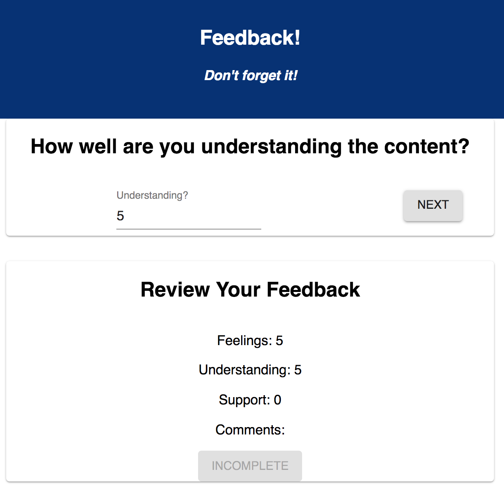

# Redux Feedback Loop

**PLEASE COMMENT YOUR CODE.**

### BEN R CUSTOM README.md TEXT

#Feedback App 

This is a full-stack feedback app for students and admins. 

##Built With

-React
-Material-UI
-Redux
-Node
-Express
-PostgreSQL


##Description

This is a feedback app that allows a user to enter feedback for a class or instructor. The app takes the user through a series of four feedback steps. The first three ask the student to enter a score between 0 and 5, with 5 being the best. The last asks for comments. 

Throughout the process, the student is able to see their scores after they are entered. After the last step, the user is again given the chance to review the scores before submitting. Upon submitting, they are brought to a thank you page, where they are given the opportunity to go through the feedback process again.

The admin page allows an admin user to view all of the entries. The admin user can also delete entries from here.

### Getting Started 

Fork and clone the repository. Then install NPM and PostgreSQL using the steps listed below. Create a database called prime_feedback and a table using the data.sql file in the repo.

### Prerequisites 
-[React] (https://reactjs.org/)
-[Redux] (https://redux.js.org/)
-[Material-UI] (https://material-ui.com/)
-[Node] (https://nodejs.org/en/)
-[Express] (https://expressjs.com/)
-[Postgres](https://www.postgresql.org/)


### Installing 

1. Fork and clone the repository
2. `npm install`
3. `npm run server` to start server.js file
4. `npm run client` to start React
5. Install PostGreSQL if you don't already have it
6. Run PostGreSQL through Brew or manually
7. Set up a database called prime_feedback 
8. Create a table using the data.sql file in the repo
9. Have fun! 

### Completed Features

- [x] Multi-step feedback process
- [x] Get, Post, Delete calls to database
- [x] Admin page to view all feedback submissions


### Next Steps

- [x] Ability for user to step back and forward
- [x] Student information - Name, email
- [x] Ability for admin to login

### Authors

* Ben Ragsdale

### Acknowledgments

* Atbash, Mary Mosman


### END BEN R CUSTOM README Text


"And my last reminder of the day, which is my last reminder of every day, is...?" - Luke

 For this assignment, you will be creating a feedback form modeled after Prime's system. Feedback will be collected over 4 views, and when all steps are complete, your app will save the feedback in the database. In a separate part of the page, display the current feedback values and a submit button. 

### SETUP

Create your database and tables using the provided `data.sql` file. Start the server.

```
npm install
npm run server
```

Now that the server is running, open a new terminal tab with `cmd + t` and start the react client app.

```
npm run client
```

### ADD NEW FEEDBACK

> NOTE: As a baseline requirement, you must use Redux to store your data across views.

Create a multi-part form that allows users to leave feedback for today. 
There will be 4 views for the form parts.
The parts:
- How are you feeling today?

- How well are you understanding the content?

- How well are you being supported?

- Any comments you want to leave?


While there is no nav bar, each part of the form should be at its own route. Clicking next should move the user to the appropriate step in the process as well as update the `Review` Component.


## THE REVIEW COMPONENT

In addition to the multi-step form, the app needs to display the results of each step clearly and at all times. HINT: This will be your current redux values displayed on the DOM. 

The simplest way could be another component on the DOM which shows the results of the current survey and a Submit button.

### Incomplete, Submit button is disabled:


### Survey complete, Submit button is active:


## SUBMIT THE FEEDBACK

The `Review` portion needs a submit button which will be clicked on to actually submit the completed feedback to the server. **This submit button should only be active when all of the survey steps are complete.**

When the submit button is clicked, save the submission in the database. The user should see a submission success page.


## STRETCH GOALS

> NOTE: These stretch goals are intended to be completed in order.

### ADMIN SECTION

Display all of the existing feedback at the route `/admin`. The most recently added feedback should appear at the top of the list. Allow the user to delete existing feedback. Prompt the user to confirm prior to deleting the feedback from the database.


### OTHER FEATURES

- Update this README.md to describe the project in your own words
- Improve the styling of the app using Material-UI theme, cards, snackbars, buttons, nav bar, and icons, and anything else you'd like.
- Add the ability to flag an existing feedback entry for further review on the /admin view
- Deploy your project to Heroku -- you'll need to read the special instructions for building and deploying with these apps! 
